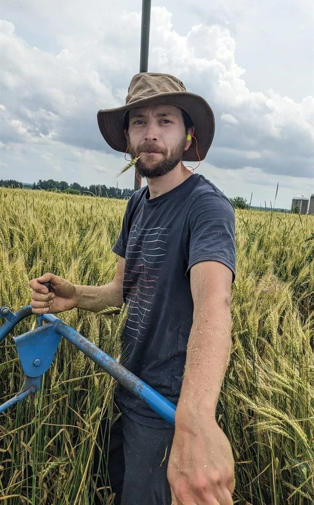
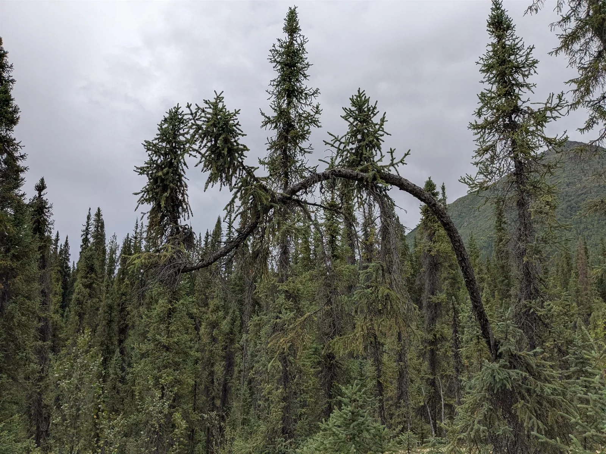
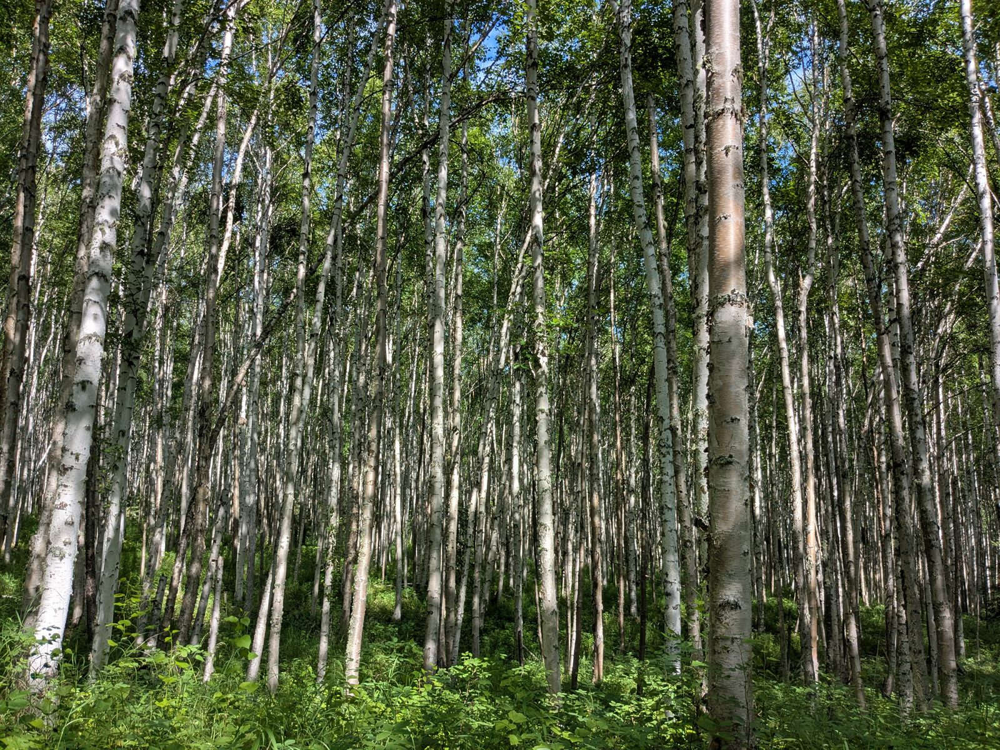
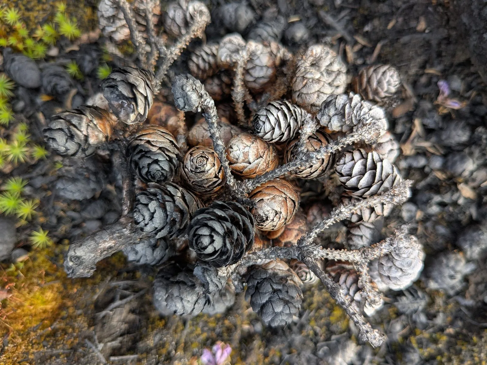

## Research interests

What mechanisms underlie change in ecosystems over time and space? I study resilience, thresholds, and interactions. These are properties of dynamical systems that appear not only in ecological systems but also social, climate, and economic ones. I'm also interested in how climate, ecosystems, and humans interact. What do changing climates and ecosystems mean for humans? What do these changes mean for food and water security? How are we shaped by, and shape, our environment?

In the [Forest Futures Lab](https://forestfutureslab.org/) I work on process-based landscape simulations of boreal North America under multiple climate scenarios, and on mapping wildfire risk at continental scale using deep learning. This year, 2026, is seeing record breaking wildfires globally, and I am developing cutting edge methods to better understand and predict wildfire risk.

```{=html}
<figure class="video-figure">
  <video controls autoplay loop muted playsinline
    width="1920" height="1440"
    aria-label="Animated map of the wildfire record in Alaska from 1980 to 2020">
    <source src="images/ak_fire_1980_2020.webm" type="video/webm">
    <p>Your browser can't play this video.
      <a href="images/ak_fire_1980_2020.webm">Download it instead</a>.</p>
  </video>
  <figcaption>Wildfire record in Alaska from 1980 to 2020.</figcaption>
</figure>
```

Much of my previous work has looked beyond the observational record. Ecosystems change over centuries and millennia, far longer than we have been measuring them, so we reconstruct ecosystem histories and past climates from traces such as fossil pollen and chemical isotopes. From these traces we can begin to estimate past interactions among species and the drivers of ecological change.

My PhD took a virtual ecology approach to a prior question: whether we can trust what the data tell us at all. It involved simulating ecosystems from population growth models with underlying threshold dynamics, then degrading those simulations to see how sampling and environmental processes change the inferences we would draw.

## Fieldwork - not just a desk ecologist

I love being out in the field. I've been out taking core samples, sampling heavy metals in streams, freshwater invertebrates, invasive fish, lake chemistry, aphids, flowering plants, and setting audio recorders and camera traps. Click on any image for a slideshow with more photos.

::: {.photo-grid}
{.photo loading="lazy" group="fieldwork"}

{.photo loading="lazy" group="fieldwork"}

{.photo loading="lazy" group="fieldwork"}
:::

<!-- Not shown on the page, but they join the lightbox: click any thumbnail above and
     arrow through all six. Captions inferred from filenames, worth checking. -->
::: {.lightbox-only}
{.photo loading="lazy" group="fieldwork"}

{.photo loading="lazy" group="fieldwork"}

{.photo loading="lazy" group="fieldwork"}
:::

## Positions

**Data Scientist** · Cary Institute of Ecosystem Studies, Millbrook, NY · 2025–present

: Automated HPC workflows for process-based landscape simulations across boreal North America under multiple CMIP6 climate scenarios. Large-scale data management using SQL and Apache Arrow, integrating climate, soil, and elevation data from distributed archives (NASA DAACs, STAC). Built an interactive interface for collaborators to query simulation outputs and generate visualisations.

**Postdoctoral Research Associate** · University of Wisconsin–Madison · 2022–2024

: NSF-funded project developing state-space modelling methods for palaeoecological records, part of the abrupt ecosystem change project led by [Jack Williams](https://williamspaleolab.github.io/people/) and [Tony Ives](https://ives.labs.wisc.edu/people/).

**Engagement Specialist** · [Centre for eResearch](https://www.eresearch.auckland.ac.nz/), University of Auckland · 2021–2022

: Seminars on data management, FAIR and CARE principles, and reproducible workflows; research-computing support for graduate students and staff across virtual machines, storage, and analytical workflows.

**Research Assistant** · University of Auckland · 2021–2022

: Bibliometric and topic analysis of the climate justice literature.

**Data Analyst** · Auckland Council · 2021

: Analysis of citizen science bird count data, and a technical report on the findings.

**Research Assistant** · Stockholm Environment Institute, York · 2016–2017

: Reconstruction of fire regimes in the North York Moors, including microscope analysis and core preparation for charcoal and spheroidal carbonaceous particles.

## Education

**PhD**, School of Environment, University of Auckland · 2017–2021

: Virtual ecological methods for generating pseudoproxy data to assess statistical inference under data uncertainty. Supervised by George Perry ([the P-lab](https://spatialecol.com/)) and Janet Wilmshurst.

**MEnv. Environmental Science**, University of York · 2012–2016

: First-class integrated master's degree. Master's research on environmental monitoring using sensor networks and robotics.

**Geocomputation & Machine Learning for Environmental Applications**, Basilicata University, Matera · 2025

: Certified course in machine learning for spatial analysis.

**Certified Carpentries Instructor**, [The Carpentries](https://carpentries.org/) · 2023

: Certified to teach and host workshops in data science and computational skills.

**Performance, Composition & Theory**, Royal Academy of Music, London · 2005–2010

: Study in performance, composition, and musical theory, with multiple competition awards.

## Teaching

I teach wherever I can, and everything I produce is open and reusable. See [Teaching](workshops-lectures.qmd) for the materials themselves.

University courses I have taught on:

- Discovering Environmental Modelling
- Natural and Human Environmental Systems
- Environmental Science and Management

I have also led the Quarto workshop at ResBaz Aotearoa and Madison (2022–2024), hosted the state-space methods workshop at ESA 2024, and run a hands-on age-depth modelling workshop for Neotoma.

## Data science

Working across empirical and theoretical ecology means a great deal of data science. My own work runs on cluster computing and virtual machines, and routinely involves data volumes that will not fit on a laptop: petabyte-scale simulation output managed with SQL and Apache Arrow, and climate, soil, and elevation layers pulled from distributed archives.

My time at the Centre for eResearch added the other side of that work: consulting on researchers' needs, secure data storage, and helping people set up analysis workflows they could actually maintain. Technical work across Linux, Bash, Slurm, HPC, and version control.

## Service

**Early Career Representative**, Neotoma Leadership Council · 2024–present

: Contributing to database governance, ingestion standards, and community user support for a global palaeoecological data resource.

I also review for ecological and palaeoecological journals.
