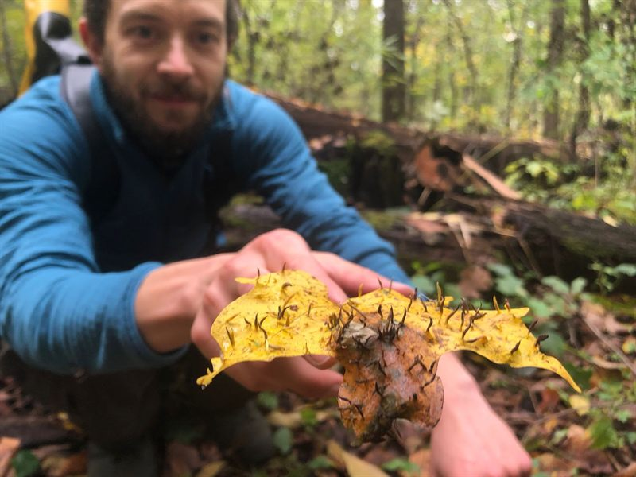

```{=html}
<div class="grid hero">
  <div class="g-col-12 g-col-sm-4 hero-photo">
    
  </div>
  <div class="g-col-12 g-col-sm-8 hero-text">
    <p class="hero-role">Data Scientist,
      <a href="https://www.caryinstitute.org/science/research-support/quinn-asena">Cary Institute of Ecosystem Studies</a>
    </p>
    <p class="hero-lede">I study how and why ecosystems change over time and space, and
      what those changes mean for the people who depend on them.</p>
    <ul class="hero-tags">
      <li>Wildfire risk mapping</li>
      <li>Boreal forest dynamics</li>
      <li>Palaeoecology</li>
      <li>Statistical ecology</li>
    </ul>
    <p class="hero-links">
      <a href="https://orcid.org/0000-0002-4086-460X">ORCID</a>
      <a href="https://github.com/QuinnAsena">GitHub</a>
      <a href="https://www.linkedin.com/in/quinn-asena-a394202a4/">LinkedIn</a>
      <a href="mailto:asenaq@caryinstitute.org">Email</a>
    </p>
  </div>
</div>
```

<hr class="section-divider">

## Selected work

```{=html}
<div class="grid section-cards">

  <a class="section-card g-col-12 g-col-md-4" href="my-research-posts/asena-2024c.html">
    <span class="section-card-meta">Methods in Ecology and Evolution &middot; 2026</span>
    <span class="section-card-title">A state-space model for ecological count data</span>
    <span class="section-card-desc">Estimating species interactions and driver&ndash;species
      relationships from multinomial time series.</span>
  </a>

  <a class="section-card g-col-12 g-col-md-4" href="my-research-posts/asena-2024b.html">
    <span class="section-card-meta">Climate of the Past &middot; 2026</span>
    <span class="section-card-title">Information loss in palaeoecological data</span>
    <span class="section-card-desc">Which sources of uncertainty matter most, and where
      sampling effort is best spent.</span>
  </a>

  <a class="section-card g-col-12 g-col-md-4" href="my-research-posts/asena-2024a.html">
    <span class="section-card-meta">The Holocene &middot; 2024</span>
    <span class="section-card-title">Is the past recoverable from the data?</span>
    <span class="section-card-desc">A virtual ecology approach to testing what fossil
      records can and cannot tell us.</span>
  </a>

</div>
```

[See all publications and research summaries →](my-research.qmd)

<hr class="section-divider">

## Explore


