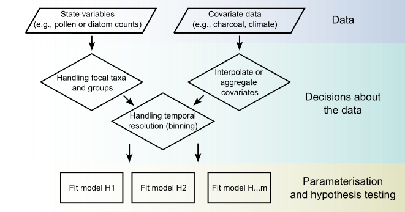

State-space modelling of multinomially distributed data.

Ecological count data are awkward. Counts of pollen grains, diatoms or individuals are
*compositional*: because the total is fixed by sampling effort rather than by the
ecosystem, a rise in one taxon forces an apparent fall in the others even when nothing
happened to them. On top of that, palaeoecological records are unevenly spaced in time
and observed with error, and there is no experiment to fall back on.

multinomialTS fits a state-space model directly to the raw counts, separating what the
community actually did from how it was observed. From that you get estimates of two
things a description of the data cannot give you: how environmental drivers relate to
each taxon, and how the taxa interact with each other.

```{=html}
<p class="actions">
  <a class="action-primary" href="https://quinnasena.github.io/multinomialTS/">Documentation</a>
  <a class="action-secondary" href="https://doi.org/10.1111/2041-210x.70315">Read the paper</a>
  <a class="action-secondary" href="https://github.com/QuinnAsena/multinomialTS">Source on GitHub</a>
</p>
```



## How it works



The model separates a *process* component, describing how the community changes, from
an *observation* component, describing how sampling turns that community into counts.
Fitting them jointly is what lets the estimates account for uneven sampling and
observation error rather than treating the counts as if they were the truth.

Because competing hypotheses are fitted as separate models, you can compare them
directly: does temperature explain the record better than fire, or than the taxa simply
interacting among themselves?

## Install

Not on CRAN. Install from GitHub:

```r
# install.packages("devtools")
devtools::install_github("https://github.com/QuinnAsena/multinomialTS")
```

The package has compiled C++ code, so building from source needs
[Rtools](https://cran.r-project.org/bin/windows/Rtools/) on Windows or
`xcode-select --install` on macOS. If you would rather not compile, pre-built binaries
for Windows, Intel macOS and Apple silicon are on the
[releases page](https://github.com/QuinnAsena/multinomialTS/releases).

## Learn it

- [multinomialTS vignette](https://quinnasena.github.io/multinomialTS/articles/multinomialTS-vignette.html), the place to start
- [Sunfish Pond example](https://quinnasena.github.io/multinomialTS/articles/sunfish_pond_example.html), a worked analysis end to end
- [Function reference](https://quinnasena.github.io/multinomialTS/reference/index.html)
- [The workshop](https://quinnasena.github.io/multinomialTS-workshop/), a hands-on walkthrough with everything you need to run it yourself. This is the maintained version; the copies made for individual conferences are frozen at whatever the package looked like on the day.

## The paper

**Asena, Q.**, Williams, J., Johnson, J., Shuman, B., Stefanova, V., Ives, A. (2026).
[Statistical analyses of ecological multinomial time series to identify environmental
drivers and biotic interactions](https://doi.org/10.1111/2041-210x.70315).
*Methods in Ecology and Evolution.*

If you would like the shorter version first, there is a
[plain-language summary](my-research-posts/asena-2024c.qmd) on this site, and a
[Methods blog post](https://methodsblog.com/2026/07/13/from-pattern-to-process-estimating-species-interactions-and-driver-species-relationships-from-count-data/)
that walks through the idea less formally.

The model was developed during my postdoc at UW–Madison with
[Tony Ives](https://ives.labs.wisc.edu/people/) and
[Jack Williams](https://williamspaleolab.github.io/people/).

## Talks

I have presented this work at ESA in 2023, 2024 and 2025, and gave an invited talk on
it for *Methods in Ecology and Evolution* in 2026. Slides and recordings are on the
[Talks](talks.qmd) page.

## How to cite

Cite the paper above for the method. For the software itself, `citation("multinomialTS")`
in R gives the current version, and the
[citation page](https://quinnasena.github.io/multinomialTS/authors.html) has it too.

Released under the MIT licence. Issues and contributions are welcome on
[GitHub](https://github.com/QuinnAsena/multinomialTS/issues).
