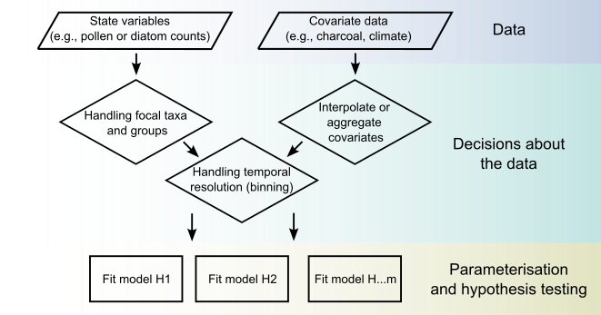

Software that came out of my research and teaching: R packages implementing methods from the papers, and interactive apps I use to teach modelling concepts. Everything is open source. The full set is on my [GitHub](https://github.com/QuinnAsena).

```{=html}
<a class="feature-card" href="multinomialts.html">
  <span class="feature-card-media">
    
  </span>
  <span class="feature-card-body">
    <span class="feature-card-meta">R package &middot; Methods in Ecology and Evolution &middot; 2026</span>
    <span class="feature-card-title"><code>multinomialTS</code></span>
    <span class="feature-card-desc">State-space modelling of multinomially distributed
      data. Estimate how environmental drivers relate to each taxon, and how taxa
      interact, directly from count data such as fossil pollen.</span>
    <span class="feature-card-more">Documentation, install, paper and workshops &rarr;</span>
  </span>
</a>
```

::: {#gallery}
:::
