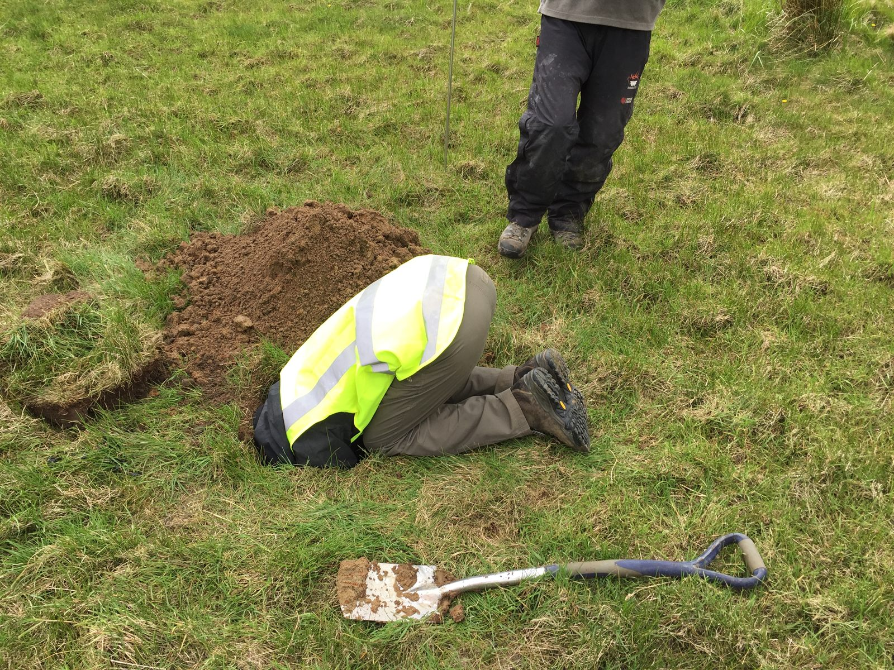
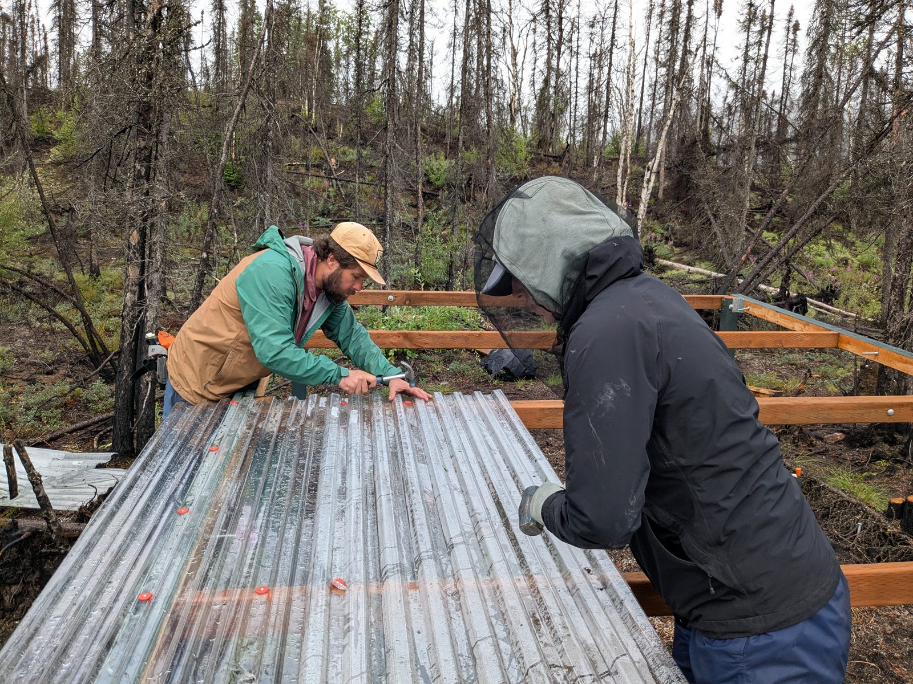
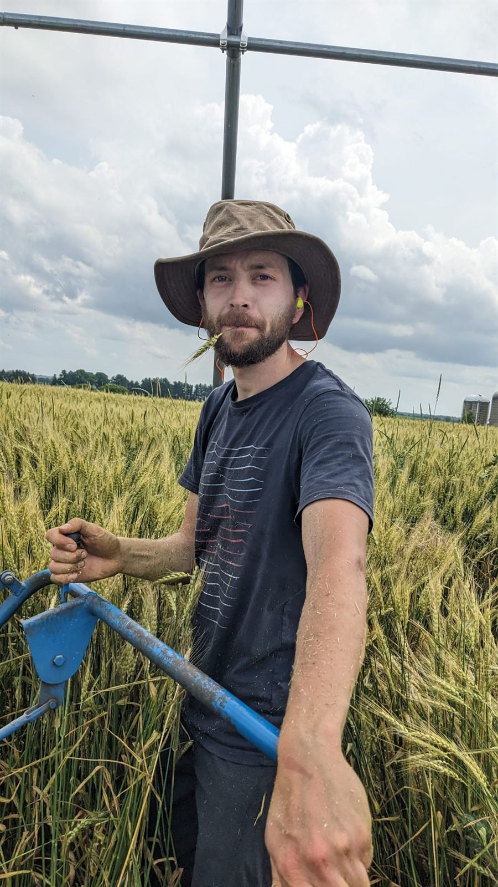
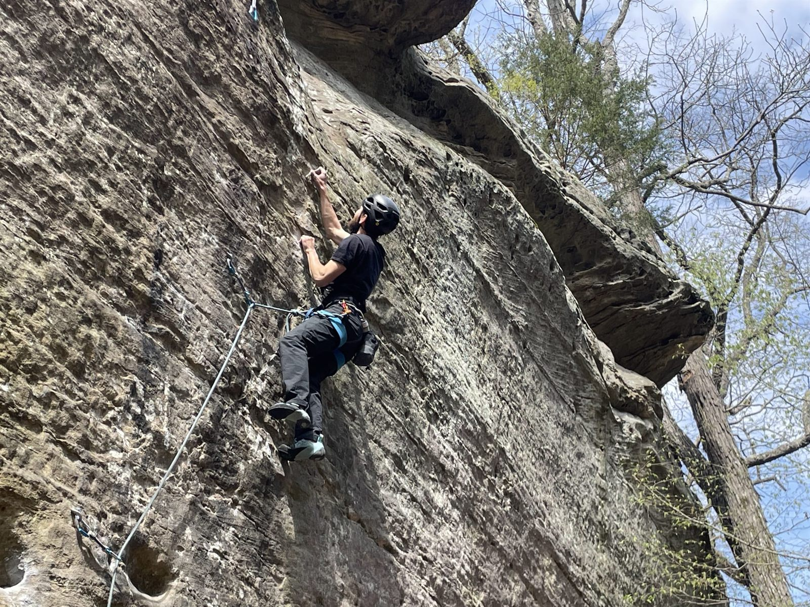

## Fieldwork

I love being out in the field and help out wherever I can. I've been out sampling heavy metals in streams, freshwater invertebrates, invasive fish, lake chemistry, aphids, and flowering plants, and setting recorders and camera traps. Coring wetlands is the work closest to my own research. The sediment that comes up is the raw material for everything on the [Research](my-research.qmd) page.

::: {.photo-grid}
{.photo group="fieldwork"}

{.photo group="fieldwork"}

{.photo group="fieldwork"}
:::

## Travel

## Art

## Climbing

{.photo group="interests"}
